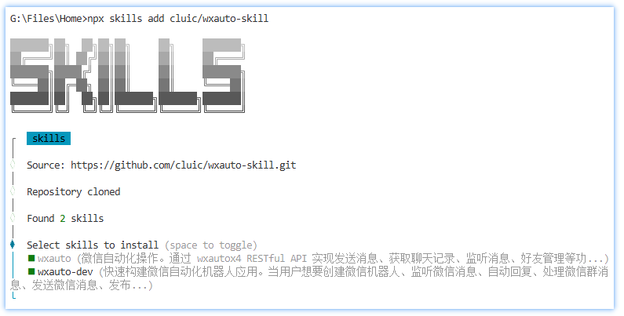

# wxauto-skill

基于 wxautox4 RESTful API 的微信自动化skill。

## 系统要求

- Python 3.9-3.12
- 操作系统：Windows 10 及以上
- wxautox4 (pip install wxautox4)
- wxauto-restful-api 服务

## 安装方式

### 使用npx安装，适用大部分AI应用（推荐）

```
npx skills add cluic/wxauto-skill
```



***
### 其他安装示例

### OpenClaw

<details>
<summary>点击展开 OpenClaw 安装说明</summary>

#### 方法一：一键安装（Windows）

1. 下载本仓库
2. 双击运行 `openclaw-install.bat`
3. 重启 OpenClaw

#### 方法二：手动安装

```powershell
# 将skill复制到 OpenClaw 技能目录
Copy-Item -Path ".\skills\wxauto" -Destination "$env:USERPROFILE\.openclaw\skills\wxauto" -Recurse -Force
```

#### 方法三：通过 ClawHub 安装

```powershell
clawhub install wxauto
```

</details>

### Claude Code

<details>
<summary>点击展开 Claude Code 安装说明</summary>

#### 通过插件市场安装

第一步：添加插件库
```
/plugin marketplace add cluic/wxauto-skill
```

第二步：安装插件
```
/plugin add wxauto-dev
```


</details>


## 使用方法

### wxauto skill

```
发微信给文件传输助手说你好
```

```
查看一下微信当前的会话列表
```

```
获取一条新消息
```

```
wxauto skill有哪些工具？
```

### wxauto-dev skill

```
使用wxauto-dev帮我创建一个微信机器人，监听文件传输助手的消息并自动回复
```

## 相关链接

- 服务项目：https://github.com/cluic/wxauto-restful-api
- ClawHub：https://clawhub.ai
- Claude Code: https://claude.ai/code
